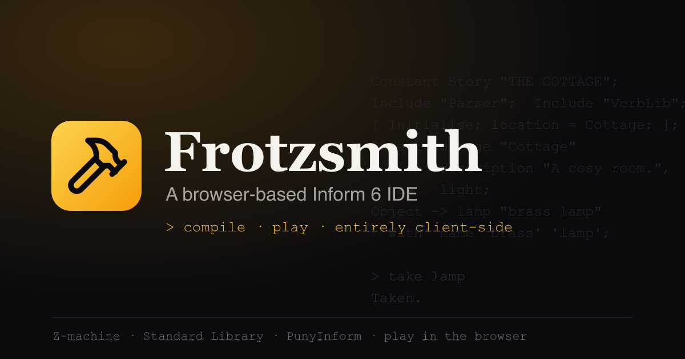

# Frotzsmith



> A personal, browser-based **Interactive Fiction** IDE — write source, compile to a Z-machine story file entirely client-side, play it inline, and run long test scripts. **Two source languages: Inform 6 (+ PunyInform), and ZIL (via ZILF).** No backend, no accounts, offline-capable.

[](./LICENSE)
[](https://nuxt.com)
[](https://www.typescriptlang.org)
[](https://github.com/DavidKinder/Inform6)
[](https://www.w3.org/WAI/WCAG21/quickref/)
[](./docs/00-master-design.md)

> **Status — Inform 6 beta · ZIL alpha.** Write **Inform 6** (at `/`) or **ZIL** (at `/zil/`) and compile to a Z-machine story file entirely in the browser — I6 via `inform6.wasm` (Standard Library or PunyInform, auto-detected), ZIL via the **ZILF** compiler built to .NET WebAssembly. Then **play it inline** via Parchment + the pure-JS ZVM, watch a **live auto-map** draw as you explore, **capture your playthrough and replay command scripts headlessly**, load worked samples (21 for Inform 6, 7 for ZIL), and pull in your own extensions. A title-strip toggle flips between the two languages, each with its own namespaced project state. See [ROADMAP.md](./ROADMAP.md) for what's next and [CHANGELOG.md](./CHANGELOG.md) for what's shipped; design docs live in [`docs/`](./docs).

## What it is

Frotzsmith mirrors the working rhythm of the classic Inform 7 IDE — source on the left, compile, watch results appear on the right where a successful build becomes a live, playable game — but for **Inform 6**, not Inform 7. It compiles entirely in the browser (the `inform6` compiler built to WebAssembly), auto-imports the correct standard library so a plain `.inf` "just works," plays the compiled story inline with [Parchment](https://github.com/curiousdannii/parchment), and exports both the raw `.z8` story file and a self-contained, offline-playable HTML bundle.

A second source language, **ZIL** — Infocom's original MDL/Lisp-like language — lives at `/zil/`. It compiles with the modern [**ZILF**](https://foss.heptapod.net/zilf/zilf/) toolchain (ZILF + ZAPF, C#/.NET) built to WebAssembly and run **on the main thread** (~5–9 s per compile; an off-main-thread Web Worker is a documented follow-up — the .NET runtime doesn't boot standalone in a Worker), with `zillib` embedded and the `<VERSION>` directive targeting z3/z5/z8. Because ZIL emits the same Z-code, everything downstream — inline play, the auto-map, test scripts, the transcript — works for ZIL unchanged. The heavy .NET bundle is lazy-loaded only on the first ZIL compile, so Inform 6 users never download it.

A power-user testing layer runs arbitrarily long command scripts (`n. examine rock. lift rock.`) through a headless replay engine and shows the per-turn transcript. Playing by hand also records every command you type into a read-only **Transcript**, and one click turns that captured playthrough into a reusable **Test Script** — the linear spine from which a full branching Skein with blessed-output regression diffing later grows.

## Why

Inform 6 is the author's favourite IF language, but browser tooling is fragmented: interpreters play *finished* story files, and the Inform 7 IDE is a desktop app tied to I7's natural-language layer. There is no clean, modern, browser-native place to **write I6, compile it, and immediately play it** with library auto-import and saved test scripts. Frotzsmith fills that gap — primarily for the author's own use, secondarily as a shareable open-source tool.

[Borogove](https://borogove.app) is the nearest neighbour and is excellent; Frotzsmith is narrower by design — Inform 6 and ZIL, profile-driven, fully static/offline, account-free, with a closer Inform 7-IDE feel and a script→Skein testing spine.

## The loop

```
write I6  ──▶  compile (inform6.wasm, client-side)  ──▶  play inline (Parchment)
   ▲                       │                                      │
   └─ clickable errors ────┘                                      ▼
      jump to the bad line                          Transcript — the commands you typed
                                                              │
                                          Copy to Test Script ─┘
                                                  │
                                                  ▼
                              Test Script  ──▶  replay headlessly  ──▶  transcript
```

## Tech stack

| Area | Choice |
|------|--------|
| Framework | Nuxt 4 (static, `ssr: false`) |
| UI | Nuxt UI 4 |
| Editor | CodeMirror 6 (Inform 6 + ZIL syntax modes) |
| Compilers | Inform 6: `inform6` → WebAssembly (Emscripten, single-threaded). ZIL: **ZILF + ZAPF** (C#/.NET 10) → .NET WebAssembly, main-thread, lazy-loaded |
| Interpreter | Parchment / ZVM (Z-machine) |
| Headless engine | pure-JS ZVM (ifvms) in a Web Worker, behind a `StoryEngine` seam |
| Language | TypeScript |
| State | Vue composables (no Pinia) |
| Testing | Vitest (unit, Node environment) |
| Theme | Dark by default, accessible light/dark toggle |
| Accessibility | WCAG 2.1 AA, axe-core zero-violation gate, fully responsive |
| Package manager | Yarn 1.22 |
| Runtime | Node 22 |
| Analytics | Plausible (privacy-friendly, cookieless) |
| Hosting | Netlify (static; publishes `dist`) |

## Roadmap

**Shipped:** client-side compile for **two source languages** — **Inform 6** (Standard Library + PunyInform, auto-detected; z3/z4/z5/z8 targets) and **ZIL** *(alpha)* via ZILF (z3/z5/z8 through the `<VERSION>` directive); a title-strip **I6 ↔ ZIL toggle** with per-language namespaced project state; clickable errors, crash-recovery autosave, **inline play** (Parchment + ZVM), a **live auto-map** drawn as you explore, named **test scripts** (persisted) replayed headlessly with a per-turn **transcript**, a read-only **Transcript** that captures the commands you type while playing (one-click **Copy to Test Script**), worked samples (21 Inform 6 · 7 ZIL), extensions (drop-in `.h`/`.zip` + a select/deselect picker), Prettify, Open / Save As, a Technical Details page, and privacy-friendly analytics.

**Next:** a Skein-style branching tree with **blessed-output regression diffing** (the test-script transcript is its linear spine), plus Send-to-Play from a script.

**Planned:** an online extensions registry, Glulx, and multi-file projects.

See [ROADMAP.md](./ROADMAP.md) for detail, [CHANGELOG.md](./CHANGELOG.md) for what's shipped, and [`docs/13-v2-roadmap.md`](./docs/13-v2-roadmap.md) for v2 feasibility notes.

## Documentation

The complete design suite lives in [`docs/`](./docs):

- [`00-master-design.md`](./docs/00-master-design.md) — thesis, locked decisions, success criteria
- `01`–`05` — phase specs (compiler core → export bundles)
- [`06-security.md`](./docs/06-security.md) · [`07-llm-build-prompts.md`](./docs/07-llm-build-prompts.md) · [`08-differentiation.md`](./docs/08-differentiation.md)
- [`09-monorepo-website.md`](./docs/09-monorepo-website.md) · [`10-revision-gap-analysis.md`](./docs/10-revision-gap-analysis.md)
- [`11-architecture-decisions.md`](./docs/11-architecture-decisions.md) — the ADR log
- [`12-use-cases.md`](./docs/12-use-cases.md) — concrete author workflows

## Development

> Prerequisites: **Node 22** (see `.nvmrc`) and **Yarn 1.22**.

```bash
yarn install
yarn dev        # local dev server
yarn test       # unit tests (Vitest, Node environment)
yarn typecheck  # nuxt typecheck (strict)
yarn generate   # static build (Netlify publishes dist)
yarn preview    # preview the static build
```

**For contributors:** state lives in Vue composables (no Pinia) — each is a pure logic file (`*.ts`, unit-tested as a sibling `*.test.ts`) plus a thin `use*` wrapper. The headless test-script engine is a `StoryEngine` seam (`app/modules/inform6/engine/`) that drives the pure-JS ZVM inside a Web Worker (`replay.worker.ts`), kept entirely separate from interactive Play, which is a same-origin Parchment iframe (`public/play/`). Design decisions are logged as ADRs in [`docs/11-architecture-decisions.md`](./docs/11-architecture-decisions.md).

## Security

Frotzsmith is fully client-side with no backend, no accounts, and no user data leaving the browser. The design-level threat model lives in [`docs/06-security.md`](./docs/06-security.md); periodic red/blue audits are logged under **Security audits** below.

## Security audits

Periodic adversarial (red-team) + defensive (blue-team) reviews of the client-side attack surface. Newest first; as audits accumulate, older entries are collapsed under a `<details>` toggle. Each finding is paired with its specific mitigation — applied or recommended.

### 2026-06-30 — Red/blue audit (play-transcript release)

**Scope:** CSP & headers, the `eval`-loaded Glk layer, the `postMessage` capture boundary, the Parchment play `<iframe>` + vendored ZVM JIT, the WebAssembly compiler, user/source/game-text rendering, extension (`.zip`) handling, `localStorage`, supply chain, and analytics.
**Method:** independent red-team (exploitation) and blue-team (controls) passes, synthesized and verified.
**Overall posture: strong** — no backend, no accounts; **no `v-html`/`innerHTML` anywhere** (every untrusted text stream renders through escaped interpolation); namespaced, quota-guarded `localStorage`; a fresh-per-run replay worker with a hard wall-clock timeout; a fully vendored interpreter (no runtime CDN code).

| Severity | Finding | Mitigation |
|----------|---------|-----------|
| **High** | **Remote story delivery + ZVM JIT injection.** The play page accepted *any* `?story=` URL and CSP allowed `data:`, so a crafted link could load an attacker-controlled Z-machine binary. The vendored ZVM compiles z-code to JS via `new Function()`; red-team analysis identified a *potential* JIT-injection path via a malicious Unicode table (not independently PoC-proven) that `'unsafe-eval'` would execute in-origin. | **Fixed** (`084aafa`): the play page now accepts **same-origin `blob:` story URLs only** (the IDE's own compiled output) and falls back to the demo otherwise; `data:` removed from CSP `connect-src`. This closes the external delivery vector, so no attacker-supplied story can reach the interpreter regardless of the JIT path. *Recommended:* track upstream `ifvms` for a codegen-layer patch. |
| **Medium** | **Zip decompression bomb.** Extension `.zip` import (`ExtensionsModal.vue`) runs `unzipSync()` with no size/entry cap; a crafted archive can crash the tab (self-upload DoS). | *Recommended:* bound decompression — cap total uncompressed size + entry count and reject over-limit archives before expanding. (Tracked.) |
| **Medium** | **Compile runs on the main thread.** `inform6.wasm` compiles synchronously with no timeout, so a pathological source can freeze the tab (`docs/06-security.md` overstated Worker isolation here). | *Recommended:* move compilation into a Web Worker with a wall-clock timeout, mirroring the replay engine. (Tracked.) |
| **Medium** | **Analytics script lacks SRI.** `nuxt.config.ts` loads the remote Plausible script without `integrity=`. | *Recommended:* self-host the script or pin an SRI hash (noting CDN auto-updates can invalidate a static hash). |
| **Low** | **`postMessage` source not pinned.** The play-command capture listener verified `origin` + a message tag but not the sender window. | **Fixed** (`084aafa`): added an `e.source === iframe.contentWindow` guard. The captured value was already inert data (appended to a list, never executed). |
| **Low** | **Header/CSP hardening.** Dead `api.iconify.design` in CSP `connect-src` (icons are bundled at build time); no `Permissions-Policy`; silent `localStorage` quota failures. | **Partly fixed** (`084aafa`): removed the dead `connect-src` entry and added `Permissions-Policy` (camera/mic/geolocation/payment denied). *Recommended:* a non-blocking "storage full" cue; a `sandbox` attribute on the play iframe as defense-in-depth. |

**Verified controls (no change needed):** the `eval` in `engine/glk.ts` runs a **build-time static** asset (not user input); the WASM compiler runs in its own sandbox with output treated as data; the compiler stderr, captured game commands, and replay output all render via escaped `{{ }}` only.

## License & attribution

Frotzsmith is licensed under the [GNU General Public License v3.0](./LICENSE) — © 2026 Christopher Schweda. It is GPLv3 because the ZIL backend bundles the GPLv3 [ZILF](https://foss.heptapod.net/zilf/zilf/) compiler and its `zillib` standard library; distributing them as part of this app requires the combined work to be GPLv3.

Bundled third-party components keep their own licenses:

- **Inform 6 compiler** and **Standard Library 6.12.8** — Artistic License 2.0 ([DavidKinder/Inform6](https://github.com/DavidKinder/Inform6))
- **PunyInform 6.7** — see [johanberntsson/PunyInform](https://github.com/johanberntsson/PunyInform)
- **ZILF + ZAPF compiler** and the **`zillib`** standard library — **GPLv3** ([zilf/zilf](https://foss.heptapod.net/zilf/zilf/), pinned at rev `5262550`), built offline to WebAssembly on the **.NET runtime** (MIT, [.NET Foundation](https://github.com/dotnet/runtime))
- **Parchment** / **ZVM (ifvms)** — MIT ([curiousdannii/parchment](https://github.com/curiousdannii/parchment))

**Inspiration:** [Borogove](https://borogove.app) — the multi-language, browser-based IF IDE that proved this could be done well in the browser. **No Borogove code is used here**; Frotzsmith is an independent take (Inform 6 and ZIL), but Borogove was a definite inspiration (and the model for the extension picker).

The **Haunted House** sample is reverse-engineered from Radio Shack's 1979 TRS-80 (Tandy Model I/III) text adventure and reimplemented in Inform 6.

A personal, weekend project — unaffiliated with any employer or organization.
